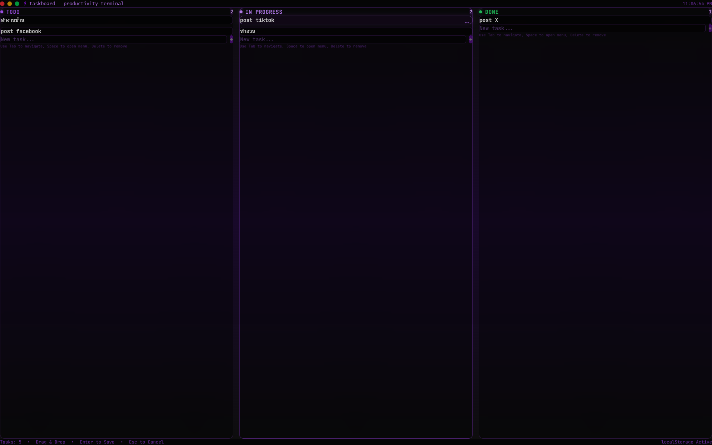

# 📋 taskboard

> A terminal-style Kanban board for productivity enthusiasts.

[](LICENSE)
[](https://www.typescriptlang.org/)
[](https://react.dev/)
[](https://tailwindcss.com/)
[](https://vitejs.dev/)

---

## 🎯 Overview

**taskboard** is a minimal, terminal-themed Kanban board built for developers who value simplicity and aesthetics. Organize tasks across columns with drag-and-drop, inline editing, and keyboard shortcuts — all with zero dependencies beyond React.

No backend. No bloat. Just pure, local productivity.

---

## ✨ Features

### Core
- **Drag & Drop** — Move tasks between columns with native HTML5 DnD
- **Inline Editing** — Double-click or press Enter to edit task text
- **Delete with Confirmation** — Safety first: confirm before deleting
- **Undo Support** — Accidentally deleted? Restore within 3 seconds
- **Toast Notifications** — Visual feedback for all actions

### Accessibility
- **Full Keyboard Navigation** — Tab, Enter, Escape, Delete keys supported
- **ARIA Labels & Roles** — Screen reader compatible throughout
- **Skip Links** — Jump to main content instantly
- **Reduced Motion** — Respects `prefers-reduced-motion`
- **High Contrast Mode** — Works with Windows/macOS high contrast settings

### Data
- **localStorage Persistence** — Tasks survive page refreshes
- **Versioned Storage** — Migration-ready data format
- **Debounced Writes** — 300ms debounce prevents excessive I/O

### UX
- **Terminal Aesthetic** — CRT scanlines, purple glow, monospace font
- **Responsive Design** — Works on mobile, tablet, and desktop
- **Empty States** — Clear guidance when columns are empty
- **Input Validation** — Min/max length checks with inline errors

---

## 🛠 Tech Stack

| Layer | Technology |
|-------|------------|
| **Framework** | React 19 + TypeScript 6 |
| **Build Tool** | Vite 8 |
| **Styling** | Tailwind CSS 4 + Custom CSS |
| **State** | React Hooks + localStorage |
| **Drag & Drop** | HTML5 Native API |
| **Font** | JetBrains Mono (Google Fonts) |

---

## 📦 Installation

```bash
# Clone the repository
git clone https://github.com/<your-username>/taskboard.git
cd taskboard

# Install dependencies
npm install

# Start development server
npm run dev

# Build for production
npm run build

# Preview production build
npm run preview
```

---

## 📁 Project Structure

```
taskboard/
├── src/
│   ├── components/
│   │   ├── Board.tsx          # Main board layout
│   │   ├── TaskCard.tsx       # Individual task card
│   │   ├── TaskInput.tsx      # Reusable task input form
│   │   ├── TerminalHeader.tsx # Header with typing animation
│   │   └── ErrorBoundary.tsx  # React error boundary
│   ├── hooks/
│   │   └── useTasks.ts        # Task state management
│   ├── styles/
│   │   └── globals.css        # Global styles & animations
│   ├── types/
│   │   └── index.ts           # TypeScript interfaces
│   ├── App.tsx                # Main application component
│   ├── main.tsx               # Entry point
│   └── index.css              # CSS variables & imports
├── public/
├── index.html
├── package.json
├── tailwind.config.ts
└── vite.config.ts
```

---

## ⌨️ Keyboard Shortcuts

| Key | Action |
|-----|--------|
| `Tab` | Navigate between elements |
| `Enter` | Add task / Save edit / Submit |
| `Escape` | Cancel edit / Close menu |
| `Delete` | Delete focused task |
| `Ctrl+K` | Focus first input field |
| `Space` | Open task menu |

---

## 🎨 Design Tokens

| Token | Value | Usage |
|-------|-------|-------|
| `--bg` | `#0D0D0D` | Background |
| `--accent` | `#A855F7` | Primary purple |
| `--text` | `#E5E5E5` | Body text |
| `--border` | `#2d1b4e` | Borders |

---

## 📸 Screenshots



---

## 🚀 Roadmap

See [ROADMAP.md](ROADMAP.md) for detailed future development plans.

### Completed ✅
- [x] Kanban board with 3 columns
- [x] Drag & drop between columns
- [x] Inline task editing
- [x] Delete with confirmation
- [x] Undo support (3s window)
- [x] Toast notifications
- [x] localStorage persistence
- [x] Keyboard navigation
- [x] ARIA accessibility
- [x] Error boundary
- [x] Reduced motion support
- [x] Responsive design

### Planned 📋
- [ ] Task priority levels
- [ ] Search & filter
- [ ] Export/Import JSON
- [ ] Task timestamps
- [ ] Dark/Light theme toggle
- [ ] Customizable columns
- [ ] Task templates
- [ ] Statistics dashboard

---

## 🤝 Contributing

Contributions are welcome! Please read the following steps:

1. Fork the repository
2. Create a feature branch (`git checkout -b feature/amazing-feature`)
3. Commit your changes (`git commit -m 'feat: add amazing feature'`)
4. Push to the branch (`git push origin feature/amazing-feature`)
5. Open a Pull Request

**Guidelines:**
- Follow existing code style (TypeScript strict mode enabled)
- Add tests for new features
- Update documentation as needed
- Keep PRs focused and small

---

## 📄 License

This project is licensed under the MIT License — see the [LICENSE](LICENSE) file for details.

---

## 🙏 Acknowledgments

- Built with [React](https://react.dev/) + [Vite](https://vitejs.dev/) + [Tailwind CSS](https://tailwindcss.com/)
- Font: [JetBrains Mono](https://www.jetbrains.com/lp/mono/)
- Inspired by terminal productivity tools and Kanban methodology

---

**Made with 💜 by Jubpas**
